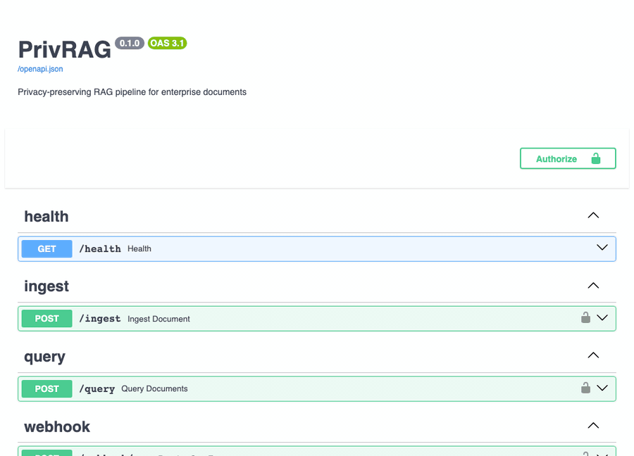

# PrivRAG

> Privacy-preserving RAG pipeline for enterprise documents

**🌐 [Try the live web app](https://privrag.vercel.app)** · **[API demo (Swagger)](https://privrag-production.up.railway.app/docs)** · [Health check](https://privrag-production.up.railway.app/health)

> Upload a document, ask a question in plain language, and watch PrivRAG strip
> RUTs / emails / phones **before** anything reaches the LLM. No signup required.

[](https://github.com/Arcan17/privrag/actions/workflows/ci.yml)
[](https://www.python.org/downloads/)
[](https://fastapi.tiangolo.com)
[](https://nextjs.org)
[](LICENSE)



A production-ready RAG application that lets companies query their internal documents in natural language — **without ever sending sensitive data to an external LLM**. Ships with a FastAPI backend and a Next.js web app, both deployed live.

Built to demonstrate four enterprise AI engineering capabilities:

| Capability | Implementation | Key Metric |
|-----------|---------------|------------|
| **RAG + semantic chunking** | ChromaDB + cosine threshold (0.50) | Retrieves relevant context; the LLM answers strictly from it |
| **Token optimization** | SHA256 cache (PostgreSQL) + sentence compression | 30-45% cache hit rate, ~15% tokens saved |
| **PII stripping** | Regex (Chilean RUT / email / phone) + optional spaCy | 100% RUT & email detection |
| **Workflow automation** | Telegram Bot + simulated CRM webhook + `/metrics` | Non-blocking async notifications |

---

## Web app

A **[Next.js web app](https://privrag.vercel.app)** (deployed on Vercel) puts a face on the API: drag in a PDF or `.txt`, ask a question, and see the privacy and performance internals surfaced live — masked PII types, cache hits, latency, tokens saved, and the retrieved source chunks.

- **Live:** https://privrag.vercel.app (no signup)
- **Source:** [`frontend/`](frontend/) — Next.js 14 + TypeScript, talks to the API via `NEXT_PUBLIC_API_BASE`
- Sample HR documents are pre-loaded, so the example questions work out of the box; or upload your own file.

> First query after the backend has been idle can take a few seconds while the
> container wakes; subsequent queries are ~1s, and cache hits ~250ms.

## Try it live (API)

The API is deployed on Railway with demo documents pre-loaded. No API key required for the public demo.

**Base URL:** `https://privrag-production.up.railway.app`

### 1. Health check
```bash
curl https://privrag-production.up.railway.app/health
```
```json
{"status": "ok", "provider": "groq"}
```

### 2. Query (no PII)
```bash
curl -X POST https://privrag-production.up.railway.app/query \
  -H "Content-Type: application/json" \
  -d '{"query": "¿Cuántos días de vacaciones tienen los empleados?", "session_id": "00000000-0000-0000-0000-000000000001"}'
```
```json
{
  "answer": "Los empleados con contrato indefinido tienen 15 días hábiles de vacaciones al año...",
  "cache_hit": false,
  "latency_ms": 843,
  "pii_found": false,
  "tokens_saved_pct": 14.2,
  "chunk_count": 3
}
```

### 3. Query with PII — automatically masked before hitting the LLM
```bash
curl -X POST https://privrag-production.up.railway.app/query \
  -H "Content-Type: application/json" \
  -d '{"query": "¿Cumplió el empleado con RUT 12.345.678-9 y correo ana@empresa.cl sus metas?", "session_id": "00000000-0000-0000-0000-000000000002"}'
```
```json
{
  "answer": "El empleado 12.345.678-9 cumplió con los requisitos de su contrato...",
  "cache_hit": false,
  "pii_found": true,
  "pii_types": ["rut", "email"]
}
```
> The RUT and email are replaced with UUID tokens **before** the embedding call and the LLM call. The LLM never sees `12.345.678-9` or `ana@empresa.cl`. Values are restored in the response using the in-memory token map.

### 4. Same query again — served from cache
```bash
curl -X POST https://privrag-production.up.railway.app/query \
  -H "Content-Type: application/json" \
  -d '{"query": "¿Cuántos días de vacaciones tienen los empleados?", "session_id": "00000000-0000-0000-0000-000000000001"}'
```
```json
{
  "answer": "Los empleados con contrato indefinido tienen 15 días hábiles...",
  "cache_hit": true,
  "latency_ms": 18
}
```
> SHA256 cache hit: response in ~18ms instead of ~800ms.

### 5. Metrics
```bash
curl https://privrag-production.up.railway.app/metrics
```
```json
{
  "queries_total": 10,
  "cache_hit_rate_pct": 30.0,
  "avg_latency_ms": 612.4,
  "p95_latency_ms": 1050.0,
  "pii_detected_count": 2,
  "tokens_saved_avg_pct": 15.1
}
```

---

## Business use cases

Especially relevant for companies handling regulated data:

- **Legal & compliance**: Query contracts without exposing client RUTs to third-party APIs
- **HR portals**: Let employees ask about policies, payroll, benefits — PII-safe
- **Healthcare**: Search clinical guidelines without sending patient data externally
- **Insurance**: Query policy documents with automatic masking of policyholder identifiers
- **Tech support**: Internal FAQ bot that strips ticket reporter contacts before hitting the LLM

---

## Architecture

```
Next.js web app (Vercel)  ──HTTPS / CORS──▶  FastAPI backend (Railway)

POST /ingest (PDF / .txt)
     ├─ [1] Extract text  →  pypdf or utf-8 decode
     ├─ [2] PII Scrubber  →  RUT / email / phone replaced with [uuid] (NOT restorable — by design)
     ├─ [3] Chunking      →  Custom recursive splitter (800 chars, 150 overlap)
     ├─ [4] Embedding     →  fastembed BAAI/bge-small-en-v1.5 (local ONNX, no API key)
     └─ [5] Vector store  →  ChromaDB persistent (hnsw:space=cosine)

POST /query {"query": "¿Cumplió el empleado 12.345.678-9?", "session_id": "..."}
     ├─ [1] PII Scrubber  →  "12.345.678-9" → [uuid]  (in-memory token map)
     ├─ [2] Embedding     →  fastembed local ONNX  (clean query, no PII)
     ├─ [3] Vector search →  ChromaDB cosine ≥ 0.50  (LLM declines if context insufficient)
     ├─ [4] Cache lookup  →  SHA256(query + context) → PostgreSQL  (HIT: ~18ms)
     ├─ [5] Compression   →  sentence dedup + tiktoken trim  (MISS path only)
     ├─ [6] LLM call      →  Groq / Anthropic / OpenAI  (never sees raw PII)
     ├─ [7] PII restore   →  [uuid] → "12.345.678-9" in response
     └─ [8] Async tasks   →  Telegram (PII-free summary) + CRM webhook (non-blocking)
```

See [ARCHITECTURE.md](ARCHITECTURE.md) for full diagrams and design decisions.

### Privacy guarantees

| Boundary | What the external service receives |
|----------|------------------------------------|
| Embeddings (local) | Clean text — no API call, no data leaves the server |
| LLM (Groq/Anthropic/OpenAI) | Scrubbed context + scrubbed query — no raw PII |
| PostgreSQL `pii_tokens` | UUID ↔ original value, TTL 2h, audit only |
| Telegram notification | PII-type summary only — never the original value |
| CRM webhook | Query hash, latency, cache status — no query text |

---

## Quick start (local)

```bash
git clone https://github.com/Arcan17/privrag.git && cd privrag
cp .env.example .env
```

Edit `.env`:
```bash
GROQ_API_KEY=gsk_...     # Free at console.groq.com — no credit card required
API_KEY=your-secret-key  # Leave empty to disable auth in local dev
```

```bash
# Production
docker compose up -d

# Development (hot-reload, DB on localhost:5432)
docker compose -f docker-compose.yml -f docker-compose.dev.yml up
```

```bash
curl http://localhost:8000/health
# {"status":"ok","provider":"groq"}
```

### Web app (frontend)

```bash
cd frontend
npm install
# point at your API (defaults to the live Railway deployment)
echo "NEXT_PUBLIC_API_BASE=http://localhost:8000" > .env.local
npm run dev          # http://localhost:3000
```

Deployed on Vercel with **Root Directory = `frontend`** (framework auto-detected as Next.js).

---

## API reference

All endpoints except `/health` and `/metrics` require the `X-API-Key` header when `API_KEY` is set.

| Method | Path | Description |
|--------|------|-------------|
| `GET` | `/health` | Health check + provider info |
| `POST` | `/ingest` | Upload PDF or .txt (max 10MB) |
| `POST` | `/query` | Natural language query with RAG + PII stripping |
| `GET` | `/metrics` | Cache hit rate, latency p95, PII count |
| `POST` | `/webhook/crm` | Simulated CRM event receiver |

---

## Running tests

```bash
pip install -r requirements.txt aiosqlite
pytest -v --tb=short
# 61 passed
```

---

## Configuration

| Variable | Default | Description |
|----------|---------|-------------|
| `LLM_PROVIDER` | `groq` | `groq`, `anthropic`, or `openai` |
| `GROQ_API_KEY` | — | Free at [console.groq.com](https://console.groq.com) |
| `ANTHROPIC_API_KEY` | — | Required when `LLM_PROVIDER=anthropic` |
| `OPENAI_API_KEY` | — | Required when `LLM_PROVIDER=openai` |
| `API_KEY` | *(empty)* | Auth key. Leave empty to disable in local dev |
| `COSINE_SIMILARITY_THRESHOLD` | `0.50` | Min similarity to include a chunk (tuned for Spanish recall; the LLM declines when context is insufficient) |
| `CORS_ORIGINS` | `*` | Comma-separated allowed frontend origins |
| `CHUNK_SIZE` | `800` | Max chars per chunk |
| `CACHE_TTL_SECONDS` | `3600` | Response cache TTL |
| `SPACY_ENABLED` | `false` | Enable spaCy NER for person/org detection |
| `AUDIT_HASH_SECRET` | *(empty)* | HMAC secret for `query_hash` in audit logs — prevents dictionary attacks on low-entropy queries |

---

## Current limitation

During ingestion, document PII is replaced with non-restorable UUID tokens by design — raw identifiers never enter the vector store. Query-time PII is scrubbed and restored only within the current request scope. This means exact identity-based lookups (e.g. "all records for RUT X") are intentionally unsupported in the demo version.

A production implementation would use **deterministic salted tokenization** (HMAC-SHA256 per tenant) so the same identifier always maps to the same token within a tenant boundary, preserving lookup semantics while keeping raw PII out of the vector store and LLM context.

---

## Production hardening roadmap

- Deterministic tenant-scoped HMAC tokenization for cross-query PII matching
- Per-tenant ChromaDB collections with namespace isolation
- Role-based access control (document-level permissions)
- Rate limiting per `session_id` / API key
- Signed audit hashes (HMAC-SHA256 with per-deployment secret)
- Background PII token TTL cleanup job with monitoring
- Evaluation suite: retrieval precision, hallucination rate, PII leakage test
- Cloud deployment with managed PostgreSQL + pgvector as ChromaDB alternative

---

## Deployment

Both halves run in production, deployed straight from `main`:

| Component | Platform | URL |
|-----------|----------|-----|
| Web app (Next.js) | Vercel (root dir `frontend/`) | https://privrag.vercel.app |
| API (FastAPI) | Railway (Docker, managed PostgreSQL) | https://privrag-production.up.railway.app |
| CI | GitHub Actions | 61 tests, zero LLM calls in the pipeline |

The backend warms the embedding model on startup and seeds demo documents on each cold start, so the public demo is usable without any setup. CORS is configurable via `CORS_ORIGINS`.

---

## Stack

- **Next.js 14 + TypeScript** — web app ([`frontend/`](frontend/)), deployed on Vercel
- **Python 3.11** — FastAPI, SQLAlchemy 2.0 async, Pydantic v2
- **PostgreSQL 16** — query cache, audit log, PII token store (TTL-governed)
- **ChromaDB 0.5** — vector store (cosine similarity, persistent volume)
- **fastembed** — local ONNX embeddings (BAAI/bge-small-en-v1.5, 384-dim, no API key)
- **Groq / Anthropic / OpenAI** — LLM generation (configurable provider)
- **Docker Compose** — production + dev override configs
- **GitHub Actions** — CI with 61 automated tests, zero LLM calls in pipeline
